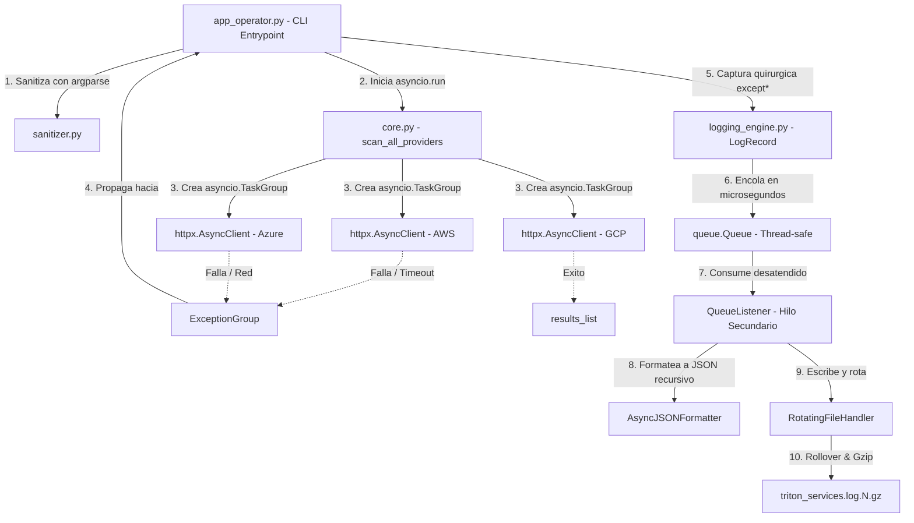
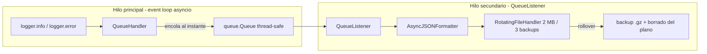

# Proyecto Tritón — Sistema de Telemetría Multicloud y Observabilidad Asíncrona

Trabajo práctico grupal. Monitor CLI (`TritonMonitor`) que consulta en paralelo las APIs de
telemetría de AWS, Azure y GCP usando `asyncio` + `httpx`, resiste fallos concurrentes de red
mediante `ExceptionGroup` capturados con `except*`, y registra todo en un pipeline de logging
JSON estructurado, no bloqueante, con rotación de 2 MB y compresión Gzip.

## Arquitectura general



## Flujo de hilos del pipeline de logging



El `QueueHandler` solo deposita el evento en memoria, por lo que el event loop nunca se bloquea
por escritura de disco. El hilo del `QueueListener` formatea, escribe, rota y comprime en segundo plano.

## Estructura del proyecto

```
triton_monitor/
├── src/
│   ├── triton_telemetry/
│   │   ├── __init__.py         # API publica del paquete (__all__)
│   │   ├── exceptions.py       # Jerarquia semantica (nunca BaseException)
│   │   ├── sanitizer.py        # Validadores argparse (timeout y cluster)
│   │   ├── core.py             # Telemetria concurrente (TaskGroup + httpx)
│   │   └── logging_engine.py   # Formateador JSON recursivo + pipeline por cola
│   └── app_operator.py         # Punto de entrada CLI (except* y finally PEP 765)
├── tests/                      # Tests unitarios y de integracion
├── scripts/
│   ├── chaos_suite.py          # Suite de simulacion de caos (rol 6)
│   └── forensic_validator.py   # Validador forense del log JSON (rol 6)
├── .github/workflows/ci.yml    # Integracion continua
├── requirements.txt            # httpx>=0.27.0
└── requirements-dev.txt        # pytest y ruff
```

## Instalación

Requisito: Python 3.11 o superior (`except*` es sintaxis de 3.11+).

```bash
python -m venv .venv
source .venv/bin/activate        # en Windows: .venv\Scripts\activate
pip install -r requirements.txt -r requirements-dev.txt
```

## Uso

```bash
python src/app_operator.py AWS Azure GCP -c cluster-us-east-01 -t 3.0 [--chaos] [-m nominal|debug|emergency] [-q|-v]
```

`--quiet` (`-q`) y `--verbose` (`-v`) son opciones mutuamente excluyentes. El modo
`nominal` muestra informacion, `debug` agrega trazas DEBUG y `emergency` muestra solo
errores. Si se especifica `-q` o `-v`, esa opcion prevalece sobre el modo.

## Guía de pruebas (escenarios oficiales)

### Escenario A — Operación nominal

```bash
python src/app_operator.py AWS GCP -c cluster-us-east-01 -t 3.0
```

Las corrutinas corren en paralelo y la consola muestra las latencias reales obtenidas de JSONPlaceholder.

### Escenario B — Validación temprana fallida (frontera CLI)

```bash
python src/app_operator.py AWS GCP -c cluster-invalido-id -t 9.5
```

La aplicación no abre el event loop ni conexiones de red: `argparse` recibe el
`ArgumentTypeError` del sanitizador, imprime la ayuda y sale con código 2.

### Escenario C — Inyección de caos (tormenta de errores)

```bash
python src/app_operator.py AWS Azure GCP -c cluster-us-west-02 -t 1.5 --chaos
```

Cada tarea captura su fallo semantico y el orquestador reconstruye un `ExceptionGroup` con todos
los errores concurrentes. Asi no se pierde la evidencia de los proveedores hermanos cuando uno
falla primero. Los bloques `except*` diseccionan cada categoria, imprimen las notas forenses
agregadas con `add_note()` y el volcado JSON completo queda en `triton_services.log`.

### Suite de caos y validación forense (rol 6)

```bash
python scripts/chaos_suite.py          # fuerza las cinco categorias de fallo y valida el log
python scripts/forensic_validator.py   # inspecciona el log plano y los backups .gz por separado
```

## Tests e integración continua

Los tests son offline (no necesitan internet), salvo el de la CLI que valida el código de salida:

| Archivo | Qué valida |
|---|---|
| `tests/test_sanitizer.py` | Rango de timeout [0.1, 5.0] y regex flexible de cluster en la frontera CLI |
| `tests/test_exceptions.py` | Herencia desde `Exception` (nunca `BaseException`) y `add_note` |
| `tests/test_formatter.py` | Serialización recursiva del `ExceptionGroup`, notas, causa y metadatos ISO 8601 UTC |
| `tests/test_core_offline.py` | Mapeo de errores de `httpx` y preservacion de fallos concurrentes con `MockTransport` |
| `tests/test_cli_integration.py` | Aborto con código 2 ante argumentos inválidos y opciones de salida excluyentes |
| `tests/test_hard_gates.py` | Prohíbe `return/break/continue` en `finally` y `except: pass` / `BaseException` |

El CI (`.github/workflows/ci.yml`) ejecuta en cada push: linting PEP 8 con `ruff` y la suite
`pytest` sobre una matriz de Python 3.11 y 3.12.

```bash
pytest tests -v
ruff check src tests scripts
```

## Mapeo semántico de errores

| Error nativo (httpx) | Excepción semántica | Causa típica |
|---|---|---|
| `httpx.TimeoutException` | `ProviderTimeoutError` | Latencia superior al `--timeout` |
| `httpx.HTTPStatusError` | `CorruptedPayloadError` | Estatus 4xx/5xx vía `raise_for_status()` |
| `json.JSONDecodeError` | `CorruptedPayloadError` | Payload no serializable (XML en lugar de JSON) |
| `httpx.RequestError` | `NetworkPeeringError` | Caída de DNS, ruteo o conectividad física |

## Roles del equipo

| Rol | Integrante | Módulo que defiende |
|---|---|---|
| Ingeniero de Robustez de Entradas y Excepciones | JUAN RASTELLINI | `exceptions.py`, `sanitizer.py` |
| Ingeniero de Concurrencia y Telemetría Asíncrona | JUAN RASTELLINI| `core.py` |
| Ingeniero de Formateo Estructurado JSON | RODRIGO TARQUE | `AsyncJSONFormatter` |
| Ingeniero de Almacenamiento y Desacoplamiento No Bloqueante |JUAN RASTELLINI | Pipeline `QueueHandler`/`QueueListener` |
| Coordinador de Integración y Flujo CLI | JUAN RASTELLINI | `app_operator.py`, empaquetado |
| Ingeniero de Simulación de Caos y Pruebas Forenses | JUAN RASTELLINI | `scripts/chaos_suite.py`, `scripts/forensic_validator.py` |

## Hardening (hard gates)

- Ninguna captura de `BaseException` ni `except: pass`.
- Ninguna sentencia `return`/`break`/`continue` dentro de bloques `finally` (PEP 765).
- Un único `RotatingFileHandler` detrás de la cola sincronizada: jamás se abre el mismo descriptor en paralelo.
- `requirements.txt` con aislamiento de dependencias y este README con diagramas Mermaid.

## Alternativas evaluadas y no implementadas

| Área | Alternativa opcionales al tp  | Motivo de no implementarla |
|---|---|---|
| Cliente HTTP | `aiohttp` | La consigna exige `httpx` |
| Reintentos de red | `tenacity` | Fuera del alcance de la consigna |
| Logging estructurado | `structlog`, `python-json-logger` | Se resolvió con stdlib (`logging`) |
| Validación de entradas | `pydantic` | La consigna exige callables de `argparse` |
| CLI | `typer` | La consigna exige `argparse` |

---

## 🏰 La historia del Reino Tritón (GitHub Pages)

¿Querés entender todo el proyecto sin leer código? Entrá al cuento ilustrado del **Reino Tritón**:
una historia con escenas dibujadas (castillo, caballero Sanitizer, mensajeros concurrentes, palomas
de `httpx`, el Tribunal de Errores, la bandeja de informes y el libro que se rota y se comprime) que
explica cada concepto del TP con un personaje del reino.

**👉 Abrir la historia:** <https://john-alexanderr.github.io/-Sistema-de-Telemetr-a-Multicloud-y-Observabilidad-As-ncrona-Proyecto-Trit-n-/docs/>


